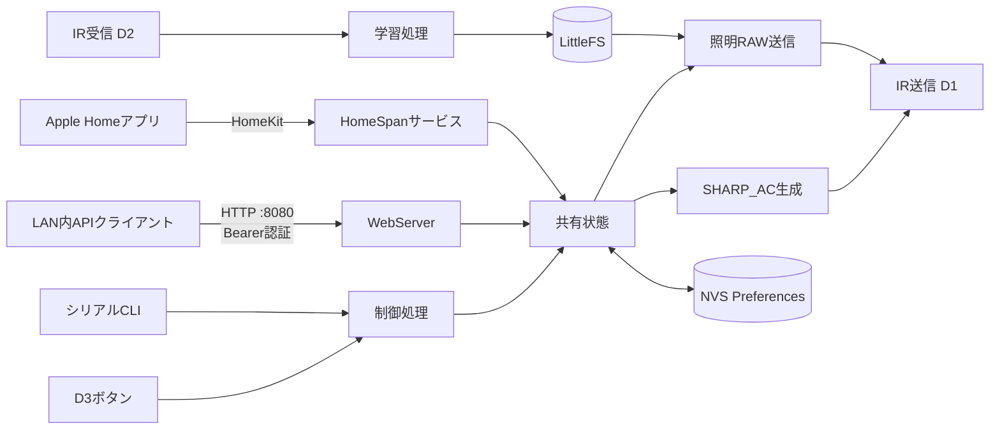
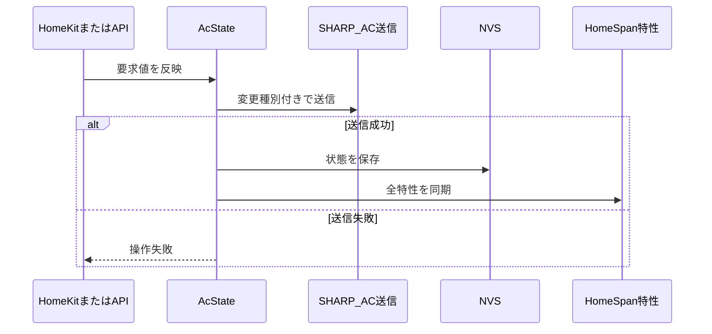
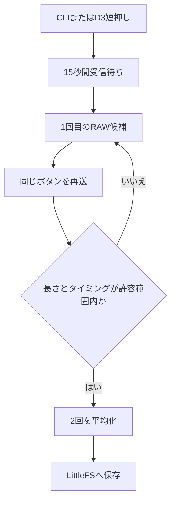

# アーキテクチャ

## 概要

このファームウェアはSeeed Studio XIAO ESP32S3上で動作し、HomeKit、LAN内HTTP API、シリアルCLI、物理ボタンからの操作を赤外線信号へ変換します。

照明とエアコンでは赤外線信号の扱いが異なります。

- 照明: 実リモコンから受信したRAWタイミングをLittleFSへ保存し、そのまま再送する
- エアコン: 実機で確認したSHARP_ACの104-bit状態を基に、現在の設定から13バイトの状態フレームを動的に生成する

## 実行環境と依存関係

- Arduino framework on ESP32
- HomeSpan: Wi-Fiプロビジョニング、HomeKitアクセサリ、シリアルCLI
- IRremoteESP8266: RAW赤外線送受信とSHARP_ACフレーム生成
- ArduinoJson: 学習済みRAWデータとAPIレスポンスのJSON処理
- LittleFS: 学習済み照明信号の永続保存
- Preferences/NVS: エアコン状態と端末固有認証情報の永続保存
- WebServer: LAN内HTTP API

依存バージョンとビルド対象は `platformio.ini` で管理します。

## ソース構成

| パス | 役割 |
| --- | --- |
| `src/main.cpp` | 起動処理、メインループ、HomeSpanサービス、API、状態管理、SHARP_AC生成、IR学習制御 |
| `include/IrCommandStore.h` | 学習済みIRコマンドのデータ構造と保存インターフェース |
| `src/IrCommandStore.cpp` | LittleFS上のJSON読み書きとコマンド検証 |
| `include/config.h` | 使用中のピン、デバイス名、設定AP名 |
| `include/config.example.h` | ハードウェア設定の公開用例 |
| `platformio.ini` | ボード、framework、依存ライブラリ、USB設定 |

現状は小規模な組み込みアプリケーションとして、主要な制御を `main.cpp` 内に集約しています。学習済みIR信号の永続化だけを `IrCommandStore` として分離しています。

## 起動とメインループ

`setup()` は次の順序で初期化します。

1. シリアル、ステータスLED、D3ボタンを初期化
2. 端末固有認証情報をNVSから読み込み、未生成なら作成
3. LittleFSをマウントし、学習済みIR信号を読み込み
4. NVSから最後のエアコン設定を読み込み
5. IR送信、SHARP_AC送信、IR受信を初期化
6. HomeSpanアクセサリとHTTP APIのルートを登録

`loop()` はブロッキングする常駐タスクを作らず、以下を順番にポーリングします。

1. HomeSpan/HomeKit処理
2. Wi-Fi接続中のHTTP API処理
3. 未設定時のセットアップAP起動判定
4. D3ボタンの短押し・長押し判定
5. IR受信と学習処理
6. 接続状態を示すLED点滅

## HomeKitモデル

1つのHomeKitアクセサリに次のサービスを登録します。

| サービス | HomeKit上の名前 | 用途 |
| --- | --- | --- |
| `LightBulb` | Smart Remote Light | 照明の「点灯」「常夜灯」信号を送信 |
| `HeaterCooler` | Air Conditioner | 電源、冷房/暖房、設定温度、風量 |
| `Switch` | Air Conditioner Dry | 除湿のON/OFF |
| `Slat` | Air Conditioner Direction | 風向固定位置と全方向スイング |

HomeKitには除湿専用のHeaterCooler状態がないため、除湿は独立したSwitchとして公開します。室温センサーも搭載していないため、`CurrentTemperature` には選択中の設定温度を反映します。

## 共有状態と同期

エアコンの正規状態はRAM上の `AcState` です。

- 電源
- モード: 冷房、暖房、除湿
- 冷房設定温度
- 暖房設定温度
- 風量: 自動、1～4
- 風向固定位置: 自動、1～5
- 全方向スイング

HomeKitとHTTP APIはこの状態を共有します。

APIからエアコンを操作した場合はHomeSpan特性も更新されます。HomeKitから操作した場合も同じ `AcState` が更新されるため、その後のAPIレスポンスへ反映されます。

照明状態の `on` は最後に送信できたコマンドから推定します。エアコン状態も最後に送信した状態であり、家電本体から取得したフィードバックではありません。別のリモコンで操作した場合や赤外線が届かなかった場合は、表示と実機が一致しない可能性があります。

## 照明IR学習と送信

照明は `light_on` と `night_light` の2コマンドを扱います。

- 受信バッファ上限は1024エントリ、保存上限は512タイミングです。
- 2回の安定した受信を確認してから既存データを置き換えます。
- タイムアウトや不安定な受信では、既存の保存データを維持します。
- 保存周波数の初期値は38kHzです。
- 送信時は学習済みRAW信号を3回、80ms間隔で再送します。

LittleFS上の `/ir_commands.json` はスキーマバージョン、周波数、RAWタイミング配列を保持します。このファイルは端末固有データであり、リポジトリには含めません。

## SHARP_AC生成

エアコンはRAWタイミングの固定再生ではなく、確認済みのA907向け13バイトテンプレートから状態フレームを組み立てます。

生成時に更新する主な情報は次の通りです。

- 電源と運転モード
- 設定温度
- 風量コード
- 風向コード
- 操作種別: 電源／モード、温度、風量、風向
- チェックサム

実リモコン表示温度はプロトコル解析値より2度高かったため、フレーム生成時に2度の補正を適用します。除湿時は温度と風量を固定形式で送信します。全方向スイングへ切り替えるときは、固定位置5のフレームとスイング切替フレームを80ms間隔で送信します。

自己送信を受信モジュールが拾わないように、SHARP_AC送信中はIR受信を一時停止し、送信後に再開します。

## HTTP API

HTTP APIはWi-Fi接続中だけポート8080で動作します。切断時はサーバーを停止し、再接続後に再開します。

すべてのルートで `Authorization: Bearer <token>` を検証します。API操作はHomeKitと同じ共有状態および送信関数を通るため、操作経路によってエアコン信号生成が分岐することはありません。

状態レスポンスには次を含みます。

- エアコンの推定状態
- 照明の推定状態と学習済みコマンドの有無
- HomeKitペアリングの有無
- Wi-Fi接続、IPアドレス、APIポート

APIの具体的なルートと使用例はREADMEを参照してください。

## 永続化

| 保存先 | 名前／パス | 内容 | 主な削除方法 |
| --- | --- | --- | --- |
| LittleFS | `/ir_commands.json` | 照明の学習済みRAW信号 | CLI `@y` |
| NVS Preferences | `sharp-ac` | 最後に送信したエアコン設定 | 通常は維持 |
| NVS Preferences | `device-auth` | APIトークン、設定APパスワード、HomeKitコード | NVS消去時 |
| HomeSpan管理領域 | HomeSpan内部 | Wi-Fi設定、HomeKitペアリング情報 | D3長押しはペアリング情報のみ削除 |

D3を約7秒長押しした場合はHomeKitペアリング情報だけを削除します。Wi-Fi設定、学習済みIR信号、エアコン状態、端末固有認証情報は維持します。

## 認証と公開時の境界

初回起動時に次の値をESP32上で生成し、NVSに保存します。

- 48桁の16進APIトークン
- 16文字の設定APパスワード
- 8桁のHomeKitペアリングコード

これらはソースコード、設定ヘッダー、LittleFSイメージには書き込みません。シリアルCLIの `@z` だけで表示します。

HTTP APIはBearer認証を要求し、CORSを有効にしていません。ただしTLSは使用していないため、APIトークンと操作内容はネットワーク上で暗号化されません。インターネットへ直接公開せず、信頼できるLAN内でのみ使用する前提です。

## 制約

- 対応エアコンは実機確認済みのSHARP A907系状態データを前提とします。
- エアコンや照明からの状態フィードバックはありません。
- IR受信は通常時にも内容をシリアルへ表示しますが、受信内容から共有状態を自動更新しません。
- 室温センサーがないため、実際の室温は取得できません。
- HTTP APIはHTTPSではありません。
- 独自Web UI、MQTT、Alexa、Google Homeの直接連携は実装していません。

## 拡張時の方針

- 新しいAPI操作は、HomeKitと同じ共有状態・送信関数を利用し、別系統の状態を作らない。
- 新しい学習コマンドを追加する場合は、`IrCommandStore::isValidCommandId()` と利用側の両方を更新する。
- 他のエアコン機種へ対応する場合は、現在のA907固有テンプレートと状態変換を機種別クラスへ分離する。
- 実センサーや双方向フィードバックを追加する場合は、推定状態と観測状態を区別してAPIおよびHomeKitへ公開する。
